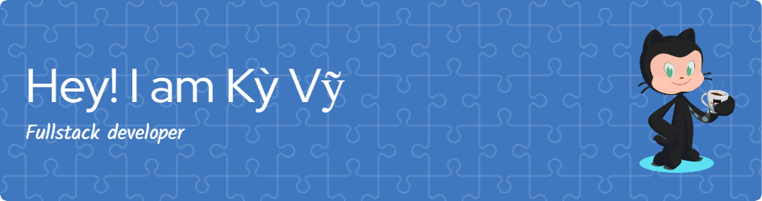

<h1 align="center">Hi 👋, I'm Nguyễn Kỳ Vỹ</h1>
<h3 align="center">aka kyvy12az • A passionate Dev from Vietnam 🇻🇳</h3>

  

---

### 🔥 About Me

- 🔭 I’m currently working on improving my full-stack skills  
- 🌱 Currently exploring: **TypeScript**, **React**, **C++**, and **Java**  
- ⚽ Hobbies: Coding 💻, Playing Football ⚽, and Watching Movies 🎬  
- 📫 Reach me via: **nguyenkyvy112az@gmail.com**  
- 💡 Fun fact: _"I debug best after midnight."_ 🌙

---

### 🛠️ Languages and Tools

#### 🧠 Languages & Frameworks

#### 🗄️ Database

#### 🎨 Frontend & Styling

#### ⚙️ Tools

---

### 📊 GitHub Stats

  
  

---

### 🌐 Connect with me

  
  

---

### ✨ Random Dev Quote

> “Any fool can write code that a computer can understand. Good programmers write code that humans can understand.” – Martin Fowler

---

### 🚀 Fun Projects Coming Soon

- 💡 Portfolio Website with React + TypeScript  
- 📱 Simple Social Media Clone  
- 🔐 Login System using PHP & MySQL  

---

⭐️ **Thanks for visiting my GitHub! Have a great day!** 😊
